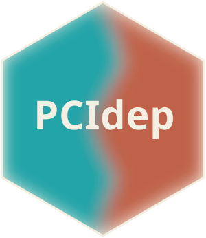

# PCIdep: Post-Clustering Inference under DEPendence 

$\texttt{PCIdep}$ is an $\texttt{R}$ package to perform selective inference after clustering under a general matrix normal model, allowing for dependence structures among both observations and features. The package is the natural extension to the general dependence setting of the work in [clusterpval](https://github.com/lucylgao/clusterpval) and [KMeansInference](https://github.com/yiqunchen/KmeansInference).

### The paper

$\texttt{PCIdep}$ is based on [this paper](https://doi.org/10.1080/01621459.2026.2707221).

### User guide

For a comprehensive introduction to post-clustering inference using $\texttt{PCIdep}$, please refer to the [user guide](https://gonzalez-delgado.github.io/PCIdep/index.html). 

### Installing PCIdep

$\texttt{PCIdep}$ can be installed using

```
devtools::install_github("https://github.com/gonzalez-delgado/PCIdep")
```

For any inquiries, please file an [issue](https://github.com/gonzalez-delgado/PCIdep/issues) or [contact us](mailto:javier.gonzalez-delgado@ensai.fr).
