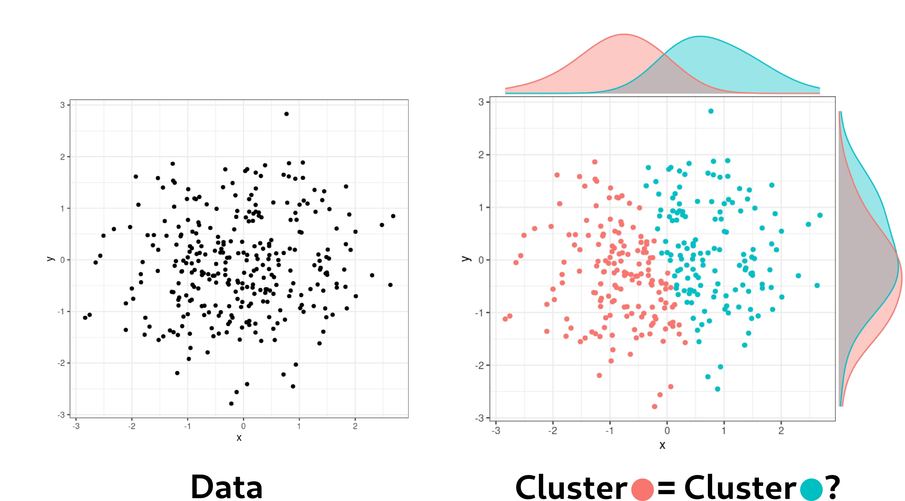

```{r setup, include = FALSE}
knitr::opts_chunk$set(
  collapse = TRUE,
  comment = "#>",
  fig.width = 7,
  fig.height = 5,
  warning = FALSE,
  message = FALSE
)
```


# Why post-clustering inference?

Clustering is one of the most common exploratory tools in statistics, biology, and data science. In a typical workflow, we observe a data matrix $\mathbf{X} \in \mathbb{R}^{n \times p}$, where the rows are observations and the columns are features. For example, the rows may be protein conformations, patients or cells, while the columns may be molecular distances, gene expression measurements, or other quantitative descriptors. 
A clustering algorithm is then applied to the data in order to identify groups of similar observations. In many applications, these groups are interpreted as reflecting underlying biological, genetic, or functional structure in the data. However, 
clustering is fundamentally an exploratory task, and interpreting its output is often much more difficult than obtaining the clustering itself. In practice, clustering raises several important statistical and interpretability questions:

- What exactly is a _cluster_?
- How stable are the discovered groups?
- Do the detected clusters correspond to biologically meaningful differences?
- Can apparent clusters arise purely from noise?

Answering these questions rigorously requires statistical tools capable of quantifying uncertainty after the clustering step has already been performed. In other words, we need to answer the question:

> _Are the clusters really different?_

At first sight, this looks like a standard two-sample testing problem. However, there is a crucial complication: the clusters (and therefore the hypothesis to test) have been selected from the data.

<div style="border-left: 4px solid #e6a817; background-color: #fdf6e3; padding: 12px 16px; margin: 16px 0; border-radius: 4px;">
  <strong style="color: #b8860b;">&#9888; The double-dipping problem</strong><br/>
  The problem is often called **double dipping**: the same data are used twice, first to discover the clusters and then to test whether those clusters differ. If we ignore this selection step and apply a
  classical test as if the clusters had been fixed in advance, the resulting $p$-values lose the type I error control. This happens because clustering algorithms are designed to find groups that look different.
  If we then test the difference between those same groups without accounting for the fact that they were selected to be different, we underestimate the amount of randomness involved.
</div>

<div style="margin-top: 1.5em;"></div>
```{r double-dipping-figure, echo = FALSE, out.width = "60%", fig.align = "center"}

```
<div style="margin-bottom: 1.5em;"></div>

## A small simulation: why naive inference fails

To illustrate the double-dipping issue in a simple setting, we simulate data with no true cluster structure: each observation is generated from the same Gaussian distribution.
We then apply $k$-means clustering, randomly pick two of the resulting clusters, and perform a classical test comparing their empirical means.
Repeating this many times shows what happens when the clustering step is ignored: under the null hypothesis the resulting $p$-values are no longer approximately uniform, 
revealing the inflation of false positives caused by naive post-clustering inference.

```{r double-dipping-simulation}
set.seed(1)

simulate_naive_pvalue <- function(n = 60, p = 5, k = 3) {

  X <- matrix(rnorm(n * p), nrow = n, ncol = p)
  cl <- kmeans(X, centers = k, nstart = 10)$cluster

  groups <- split(seq_len(n), cl)
  pair <- sample(seq_along(groups), 2)

  g1 <- groups[[pair[1]]]
  g2 <- groups[[pair[2]]]

  x1 <- X[g1, , drop = FALSE]
  x2 <- X[g2, , drop = FALSE]

  diff <- colMeans(x1) - colMeans(x2)
  s2 <- apply(X, 2, var)

  stat <- sum(
    diff^2 /
    (s2 * (1 / length(g1) + 1 / length(g2)))
  )

  pchisq(stat, df = p, lower.tail = FALSE)

}

B <- 500
p_naive <- replicate(B, simulate_naive_pvalue())

alpha <- c(0.01, 0.05, 0.10)
fp_rate <- sapply(alpha, function(a) mean(p_naive < a))

knitr::kable(
  data.frame(
    `Significance level` = paste0(alpha * 100, "%"),
    `Expected false positive rate` = paste0(alpha * 100, "%"),
    `Observed false positive rate` = paste0(round(fp_rate * 100, 1), "%"),
    check.names = FALSE
  ),
  align = "ccc",
  caption = "Proportion of rejections under the null hypothesis using naive inference after k-means clustering (500 simulations). Without accounting for the clustering step, the false positive rate is severely inflated above the nominal level."
)
```


## Addressing double-dipping

[Selective inference](https://arxiv.org/abs/1410.2597) is the statistical theory that aims, among other goals, to provide principled strategies to avoid double-dipping when the model, hypothesis, or question is chosen adaptively from data.
In this data-driven setting, the literature proposes several [families of approaches](https://doi.org/10.1162/99608f92.fc62b261), including (but not limited to): simultaneous inference, [universal inference](https://doi.org/10.1073/pnas.1922664117), 
sample splitting, data fission/thinning, and conditional inference. Up-to-date, _only conditional-based approaches have been shown efficient in the context of inference after clustering_, starting with the seminal work of
[Gao _et al._ (JASA, 2022)](https://doi.org/10.1080/01621459.2022.2116331). 

<div style="border-left: 4px solid #27ae60; background-color: #eafaf1; padding: 12px 16px; margin: 16px 0; border-radius: 4px;">
  <strong style="color: #27ae60;">💡 Suitability of data fission/thinning for post-clustering inference</strong><br/>
  The suitability of techniques like data fission/thinning ([Leiner _et al._, 2023](https://doi.org/10.1080/01621459.2023.2270748), [Neufeld _et al._, 2025](https://doi.org/10.1080/01621459.2024.2421998))
  still remains an open question in the context of inference after clustering. Despite notable [recent advances in parameter estimation](https://doi.org/10.1093/biomet/asaf057), robust estimation 
  in the context of clustering remains unclear, as discussed by [Hivert _et al. (2026)_](https://arxiv.org/abs/2405.13591).
</div>

# Selective type I error: the conditional inference approach

Post-clustering inference aims to control the probability of false rejection **conditional on the clustering event**. This is referred to as _selective_ type I error control.
More formally, if \(\mathcal{C}(\mathbf{X})\) denotes the clustering partition obtained from the data and \(C_1\), \(C_2\) are two clusters found by the algorithm, the selective type I error is 
controlled at level \(\alpha\) if

\[
\mathbb{P}_{H_0^{\{C_1,C_2\}}}
\left(
\text{reject } H_0^{\{C_1,C_2\}} \mid C_1,C_2 \in \mathcal{C}(\mathbf{X})
\right)
\leq \alpha,
\]

where $H_0^{\{C_1,C_2\}}$ is the null hypothesis of equality of clusters that needs to be specified for a given data model.

# The `PCIdep` approach

## The statistical model

The `PCIdep` package is designed for post-clustering inference under a [matrix normal model](https://en.wikipedia.org/wiki/Matrix_normal_distribution) with possible dependence between observations and/or features:

\[
\mathbf{X} \sim \mathcal{MN}_{n \times p}(\boldsymbol{\mu}, \mathbf{U}, \boldsymbol{\Sigma}).
\]

Here:

- \(\boldsymbol{\mu} \in \mathbb{R}^{n \times p}\) is the mean matrix;
- \(\mathbf{U} \in \mathbb{R}^{n \times n}\) describes dependence between observations;
- \(\boldsymbol{\Sigma} \in \mathbb{R}^{p \times p}\) describes dependence between features.

This means that:

- Every row $X_i$ of $\mathbf{X}$ is distributed as $\mathcal{N}_p(\mu_i, U_{ii}\boldsymbol{\Sigma})$,
- Every column $X^j$ of $\mathbf{X}$ is distributed as $\mathcal{N}_n(\mu^j, \Sigma_{jj}\mathbf{U})$,
- The covariance between two entries $X_{ij}$ and $X_{i'j'}$ is given by $\mathrm{Cov}(X_{ij}, X_{i'j'}) = U_{ii'} \Sigma_{jj'}$,

or, equivalently,

\[
\mathrm{vec}(\mathbf{X}) \sim \mathcal{N}_{np}\left(\mathrm{vec}(\boldsymbol{\mu}), \boldsymbol{\Sigma} \otimes \mathbf{U}\right).
\]

In this setting, independent observations correspond to $\mathbf{U} = \mathbf{I}_n$, while independent features correspond to $\boldsymbol{\Sigma} = \sigma^2\mathbf{I}_p$.

<div style="border-left: 5px solid #8e44ad; background: linear-gradient(135deg, #f8f1fc 0%, #fcf8fe 100%); padding: 14px 16px; margin: 16px 0 18px 0; border-radius: 8px; box-shadow: 0 1px 4px rgba(142, 68, 173, 0.08);">
  <strong style="color: #6c3483; font-size: 1.04em;">The null hypothesis</strong>

  In this model, the equality of clusters $C_1$ and $C_2$ is expressed as the equality of cluster means, defined as $\bar{\mu}_{C} = \frac{1}{|C|} \sum_{i \in C} \mu_i$ for any cluster $C$.
  This means that the null hypothesis is written as:

  \[
  H_0^{\{C_1,C_2\}}: \bar{\mu}_{C_1} = \bar{\mu}_{C_2}.
  \]
</div>

## Model assumptions to compute a $p$-value

### $\mathbf{U}$ must be known and compound symmetric

In the [PCIdep paper](https://arxiv.org/abs/2310.11822), we show that a $p$-value for $H_0^{\{C_1,C_2\}}$ can be computed in closed form, provided that
the dependence structure between observations $\mathbf{U}$ is known and belongs to the class of compound symmetry matrices.

<div style="border-left: 4px solid #e6a817; background-color: #fdf6e3; padding: 12px 16px; margin: 16px 0; border-radius: 4px;">
  <strong style="color: #b8860b;">&#9888; $\mathbf{U}$ must be compound symmetric</strong>

  The class $\mathcal{CS}(n)$ of compound symmetry matrices of size $n$ is defined as:

  \[
  \mathcal{CS}(n)
  = \left\{
  (a-b)\mathbf{I}_n + b\mathbf{1}_{n\times n}
  :
  a \ge 0,
  -\frac{a}{n-1} < b < a
  \right\}.
  \]

  where $\mathbf{1}_{n\times n}$ is the $n \times n$ matrix of ones. In the [PCIdep paper](https://arxiv.org/abs/2310.11822), we show that the testing
  procedure is <strong>robust to deviations from</strong> $\mathcal{CS}(n)$, so that the method can be applied in practice if the known matrix $\mathbf{U}$ does not
  present substantial deviations from the compound symmetry class (e.g. for autoregressive processes).

  Note that the case of independent observations is trivially included in this setting, since the identity matrix belongs to $\mathcal{CS}(n)$.
</div>

The closed form of the $p$-value when $\mathbf{U} \in \mathcal{CS}(n)$ is detailed in Section 2 of the [PCIdep paper](https://arxiv.org/abs/2310.11822).

### $\boldsymbol{\Sigma}$ can be unknown and arbitrary

One of the main contributions of the `PCIdep` approach is that the dependence structure between features $\boldsymbol{\Sigma}$
can be unknown and estimated in practice, while respecting the validity of the resulting $p$-value.

<div style="border-left: 4px solid #27ae60; background-color: #eafaf1; padding: 12px 16px; margin: 16px 0; border-radius: 4px;">
  <strong style="color: #27ae60;">💡 In practice</strong><br/>
  The functions in `PCIdep` automatically estimate $\boldsymbol{\Sigma}$. As statistical guarantees are respected <em>asymptotically</em>, 
  the sample size $n$ should be sufficiently large for the resulting $p$-values to be valid.
</div>

Technical details on the estimation of $\boldsymbol{\Sigma}$ and the resulting asymptotic validity of the $p$-values are provided in Section 3 of the [PCIdep paper](https://arxiv.org/abs/2310.11822).

# `PCIdep` in practice

This vignette introduced the statistical motivation of post-clustering inference, the matrix normal model used in `PCIdep`, 
and the selective framework behind valid $p$-values after clustering. To see how to compute these $p$-values and use `PCIdep` in practice:

- For hierarchical agglomerative clustering (HAC) and $k$-means, see [the HAC and $k$-means vignette](hac-km-clustering.html).
- For user-defined or custom clustering procedures, see [the custom clustering vignette](custom-clustering.html).

